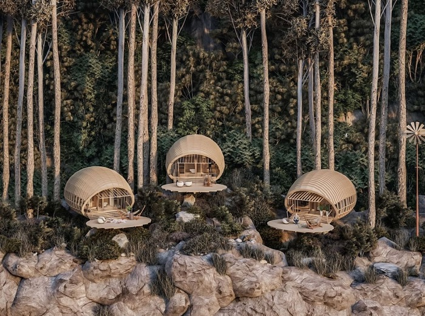
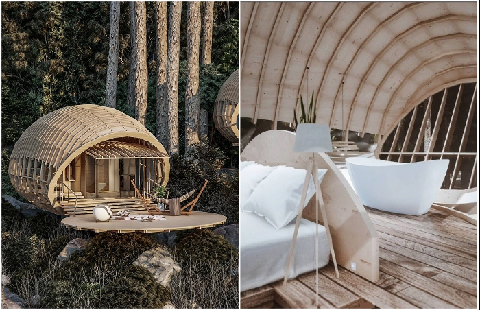
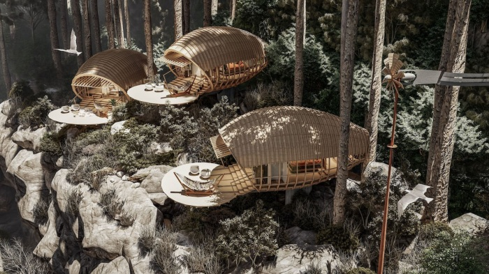
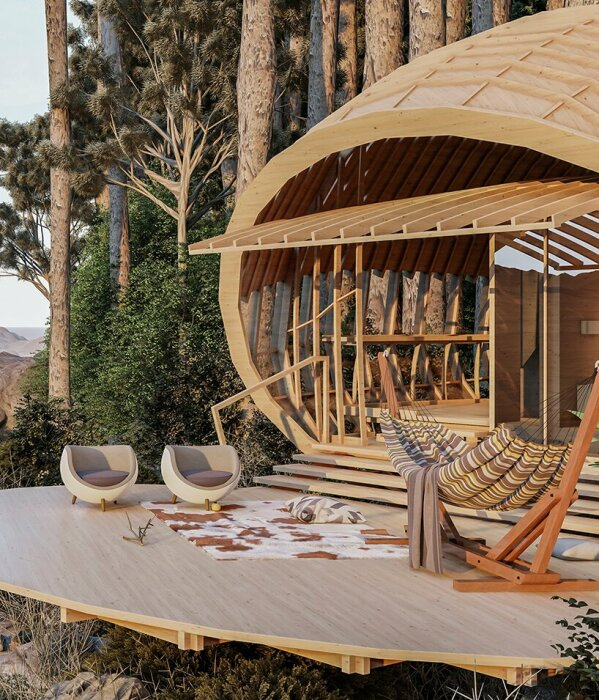

# Rest in cocoon suites "floating" on picturesque slopes in the woods

Modern architects are increasingly turning their eyes to organic architecture, which is inspired by nature itself. Especially impressive are the conceptual designs of hotel rooms, which can become a refuge for people who have had enough of luxury resorts and seek solitude in the lap of nature. Most recently, a Cuban architect offered his vision of a mountain chalet for relaxation with a conceptual design of charming cocoon rooms "floating" on picturesque slopes.

## Who among us doesn't dream of a full-fledged vacation away from the wearisome work, city noise and gadgets lingering in the Net? 

The perfect place to relax and completely reset can be the forest, mountains, rivers, and water. Only nature can bring peace and tranquility to our lives. In order to fulfill the dream of city dwellers to be in touch with nature, many architects and designers together with hoteliers are trying to create extraordinary hotel rooms, which will be an ideal refuge and literally allow you to merge with the environment.

Such as the cocoon rooms designed by the young Cuban architect Jorge Luis Veliz Quintana, founder of the Veliz Arquitecto design studio. His charming mountain chalets are designed for "short stays for climbers and tourists interested in direct contact with nature." All those who yearn to enjoy the incredible view of the mountain landscape and wild forest will have that opportunity if someone decides to bring the conceptual project Cabins On The Mountain to life.

## The project is designed with organic architecture and respect for nature. 

The base of each room is concrete supports, which have a minimum area of contact with the ground. And already on them a "floating" wooden platform is formed, on which a wooden lodge, more like a woven cocoon made of vine, with spans on the sides of the structure and its facades, is assembled. Despite the seeming transparency of the living space, each module can be positioned so that visitors can enjoy only picturesque views of the fragrant valley, with minimal view of their neighbors.

By increasing the platform area, it was possible to create an open balcony with an outdoor seating area with space for a hammock.

